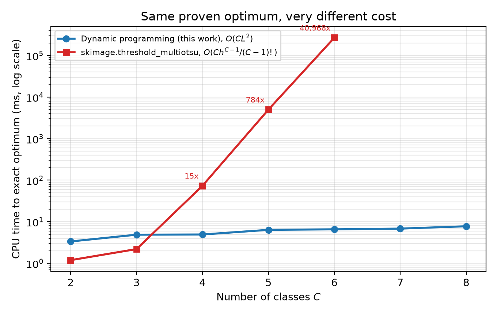
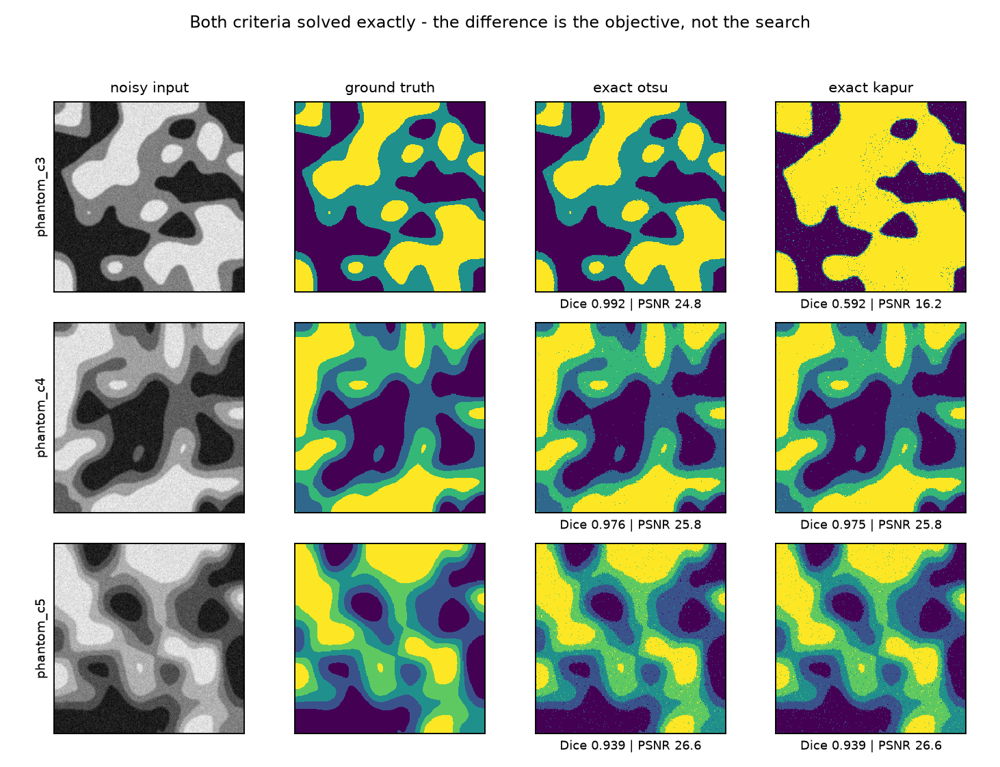
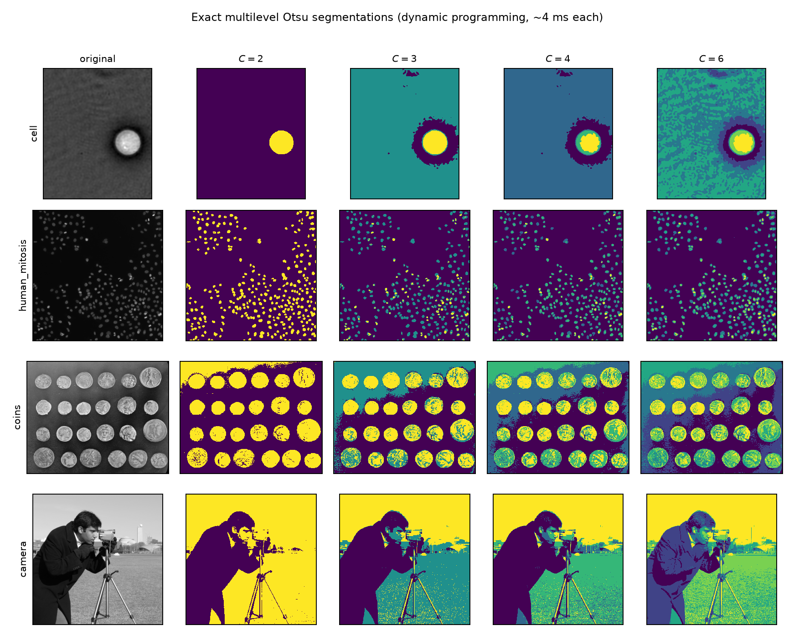

# threshmh — exact and metaheuristic multilevel image thresholding

Multilevel Otsu and Kapur thresholding have an **exact** `O(C·L²)` dynamic-programming
solution that runs in milliseconds. This repository implements that solver, then measures
four metaheuristics against it under a fixed evaluation budget with non-parametric
statistics — and asks what, if anything, the metaheuristics are for.

---

## Findings

**28,000 runs · 14 images · 2 criteria · C ∈ {2…6} · 25 seeds per cell · budget enforced inside the objective**

### 1. The metaheuristics work. They are still unnecessary.

Reaching the *proven* optimum, as a percentage of runs:

| | C=2 | C=3 | C=4 | C=5 | C=6 |
|---|---|---|---|---|---|
| **Exact DP** | **100%** | **100%** | **100%** | **100%** | **100%** |
| PSO | 100% | 97% | 93% | 90% | 81% |
| DE/rand/1/bin | 100% | 99% | 92% | 86% | 64% |
| GA | 100% | 96% | 87% | 66% | 48% |
| Random search | 98% | 7% | 0.3% | 0% | 0% |

Random search collapses past C=3, so the search machinery is doing real work — this is not a
strawman. Friedman χ² = 568.34, p = 7.3e-123 over 280 blocks; every pairwise difference
survives Holm correction; Cliff's δ against random search is −0.65 to −0.73 (**large**) for
all three.

And all of it is competing with a solver that returns the proven optimum **100% of the time,
in 3.4–7.8 ms**, for every C tested.

### 2. Exact multilevel thresholding is cheap — and flat in C



| Classes | Exact DP | `skimage.threshold_multiotsu` | Speed-up | Same optimum |
|---|---|---|---|---|
| 2 | 3.4 ms | **1.2 ms** | 0.4× | ✅ |
| 3 | 4.9 ms | **2.2 ms** | 0.5× | ✅ |
| 4 | 4.9 ms | 73.6 ms | 15× | ✅ |
| 5 | 6.4 ms | 5,003 ms | 784× | ✅ |
| 6 | **6.6 ms** | **269,034 ms** | **40,968×** | ✅ |
| 7–8 | 6.8–7.8 ms | not run (hours) | — | — |

CPU time, best-of-N; the optima agree to 1e-9 at every tested C.

**Note the first two rows honestly: `threshold_multiotsu` is *faster* than the DP at C=2 and
C=3**, because the DP pays an `O(L²)` table-construction cost that only amortises from C=4
onward. For the two- and three-class case that scikit-image is overwhelmingly used for, its
implementation is the better choice, and its complexity is documented rather than hidden.

The point is not that scikit-image is slow. It is that the combinatorial framing is what makes
exact multilevel thresholding *appear* expensive at higher C — and that appearance is the
premise the metaheuristic literature rests on.

### 3. At C=2 the evaluation budget exceeds the entire search space

The feasible set is `binom(255, C−1)`. At C=2 that is **255 candidate thresholds**, against a
budget of **1,000 evaluations** — 3.9× more than exhaustive enumeration would need. Every
algorithm scores 100% there, and the number means nothing.

### 4. The conventional metrics are not wrong — they are arbitrary where it counts

On ground-truth phantoms, comparing the two criteria at their *proven optimal* thresholds:

| Metric | Picks a different criterion than Dice |
|---|---|
| PSNR | 0 of 5 |
| SSIM | 2 of 5 |
| FSIM | 4 of 5 |

Every disagreement occurs where the two segmentations differ by **< 0.005 Dice**. In the one
case where they genuinely differ (Dice 0.992 vs 0.593), all three metrics agree with Dice.

So PSNR, SSIM and FSIM track segmentation quality when the gap is large, and become arbitrary
when it is small — which is precisely the regime in which papers report them to separate
competing methods.



### 5. A negative result: the discretisation rule does not matter here

Papers in this area almost never state how they map a continuous search vector onto sorted
integer thresholds. Two reasonable rules — forcing distinct thresholds, or allowing duplicates
so classes may collapse — differ by **at most 0.1 percentage points** of hit rate at any class
count.

For these algorithms on this problem, the choice is immaterial. That is worth reporting
precisely because it is usually left unstated, and a reader otherwise cannot tell whether it
mattered.

---




## Reproduce

```bash
make env       # pinned virtual environment (uv + Python 3.12)
make test      # 96 tests, including the correctness proofs below
make all       # regenerate every table and figure from results/
```

To re-run the experiments from scratch (~45 min on 10 cores; `scaling` should be run on an
otherwise idle machine, since it is a timing measurement):

```bash
make experiment && make scaling && make metrics && make report
```

## What is measured

| | |
|---|---|
| **Objectives** | Otsu (between-class variance) and Kapur (entropy), both maximised |
| **Exact solver** | Interval dynamic program, `O(C·L²)`, proven global optimum |
| **Search algorithms** | Random search, DE/rand/1/bin, PSO (inertia 0.9→0.4), real-coded GA (SBX + polynomial mutation) |
| **Images** | 9 from `skimage.data` (including `cell`, `human_mitosis`, `microaneurysms`, `retina`) + 5 synthetic phantoms with known ground truth |
| **Class counts** | C ∈ {2, 3, 4, 5, 6} |
| **Discretisation** | Two repair strategies, compared explicitly |
| **Budget** | 1000 × (C−1) function evaluations, enforced inside the objective |
| **Runs** | 25 per cell, seeds derived from one master seed and recorded per row |
| **Statistics** | Friedman → Holm-corrected pairwise Wilcoxon signed-rank → Cliff's δ |

## How it was tested

Three independent correctness checks on the exact solver, because every other number in
this repository is measured against it:

1. **Brute force.** On a 24-bin histogram, exhaustive enumeration over all threshold
   combinations is feasible. The DP ties it for both criteria at C = 2, 3, 4.
2. **An independent exact implementation.** The DP's optimum matches
   `skimage.filters.threshold_multiotsu` to 1e-9 relative at C = 2…5.
3. **Dominance.** Across 5,000 random threshold vectors per configuration, nothing ever
   exceeds the DP's value.

Plus: the scalar scorer used in the inner loop and the vectorised scorer used by the DP are
asserted equal to machine precision on random inputs — if they ever drift, the optimizer and
the exact solver are no longer optimising the same function, and every comparison here is
void.

## Related work, and what is new here

| | |
|---|---|
| Otsu (1979) | Between-class variance criterion |
| Kapur, Sahoo & Wong (1985) | Entropy criterion |
| **Liao, Chen & Chung (2001)** | Fast exact multilevel thresholding via precomputed moment tables |
| **Luessi et al. (2006)** | Exact multilevel thresholding by dynamic programming |
| A large metaheuristic literature | PSO, GA, DE, and many metaphor-named algorithms applied to the same two criteria, compared against *each other* |

**The dynamic program in this repository is not novel and is not claimed to be.** It is the
standard interval DP, and exact solutions have been in print for two decades. What is new
here is the comparison that this literature does not perform: metaheuristics measured
against the *proven optimum* rather than against one another, on a reproducible benchmark,
with the cost of exactness actually measured rather than assumed.

The gap this fills is a specific one. If you know the exact optimum, "our algorithm beat
theirs by 0.3%" stops being the interesting quantity, and "both are within 1e-5 of an answer
obtainable in 4 ms" takes its place.

`skimage.filters.threshold_multiotsu` is also exact, and its documented complexity is
`O(C·h^(C-1)/(C-1)!)` — a combinatorial search rather than a DP. It is the faster choice at
C = 2–3 and becomes unusable by C = 7. **That scaling, not the problem itself, is what makes
exact multilevel thresholding look expensive at higher class counts** — and that appearance
is the premise the metaheuristic framing rests on.

## Limitations

Stated plainly, because the scope of the claim matters more than its strength.

1. **The result is about separable criteria.** The DP works because Otsu and Kapur decompose
   into a sum of per-class terms over contiguous intensity intervals. Criteria that couple
   non-adjacent classes — some fuzzy-entropy and 2-D histogram formulations — do not
   decompose this way, and a metaheuristic may be genuinely necessary there. **This
   repository does not show that metaheuristics are useless for image thresholding. It shows
   they are unnecessary for the two criteria they are most often applied to.**
2. **Tuning cannot change the direction of the result.** The four algorithms run at standard
   published parameters. A tuned metaheuristic would close the gap — but the gap is to a
   *proven global optimum*, so tuning can at best reach parity, never advantage.
3. **A larger budget would raise the hit rates**, and a smaller one would lower them. The
   budget is stated, fixed, and enforced inside the objective; it is not tuned per algorithm.
4. **1-D histograms of single-channel 8-bit images only.** 2-D histogram thresholding
   (intensity × local mean) has an `L⁴` DP term and is not tested here. Joint colour-channel
   thresholding is a different problem.
5. **Ground truth is synthetic.** The phantoms give exact Dice, which is what makes the
   metric disagreement measurable at all — but they show *that* reconstruction metrics and
   segmentation accuracy can disagree, not how often that happens on annotated clinical data.
6. **FSIM is our own implementation** — see the caveat below.

## Results

Generated artifacts, all rebuilt by `make report`:

| File | Contents |
|---|---|
| [`RESULTS.md`](RESULTS.md) | Auto-generated summary of every headline number |
| [`paper/tables/hit_rate.md`](paper/tables/hit_rate.md) | Fraction of runs reaching the exact optimum |
| [`paper/tables/rel_gap.md`](paper/tables/rel_gap.md) | Median relative gap [IQR] by algorithm and C |
| [`paper/tables/statistics.md`](paper/tables/statistics.md) | Friedman ranks, Holm-corrected Wilcoxon, Cliff's δ |
| [`paper/tables/repair.md`](paper/tables/repair.md) | Effect of the discretisation rule |
| [`paper/tables/scaling.md`](paper/tables/scaling.md) | DP vs. `threshold_multiotsu` timing |
| [`paper/tables/metric_disagreement.md`](paper/tables/metric_disagreement.md) | Where the reconstruction metrics and Dice pick different winners, with Dice margins |
| [`paper/tables/search_space.md`](paper/tables/search_space.md) | Search-space size against the evaluation budget |
| `paper/figures/scaling.png` | Exact-method cost against C |
| `paper/figures/hit_rate.png` | Success rate against a solver that never fails |
| `paper/figures/gap_by_class.png` | Distribution of the gap to the optimum |
| `paper/figures/examples.png` · `criteria.png` | Qualitative panels |

## Metrics, and a caveat about them

PSNR, SSIM and FSIM compare the segmented image against the **original greyscale**, so they
reward preserving intensity detail rather than assigning pixels to the right class. They are
what this literature reports; they are not what a practitioner wants. On the synthetic
phantoms the true class map is known, so Dice is exact and the two can be compared directly.

The result is more interesting than a simple indictment. These metrics **do** track
segmentation quality when the gap is large — the one phantom where the two criteria differ
substantially (Dice 0.99 vs 0.59) is flagged correctly by all of them. They become arbitrary
only when the two segmentations are near-identical, which is precisely the regime in which
papers report them to separate competing methods. See
[`paper/tables/metric_disagreement.md`](paper/tables/metric_disagreement.md), which reports
every disagreement **with its Dice margin** so a tie-break cannot be mistaken for a
contradiction.

The FSIM implementation here is our own. It is validated on the *properties* an FSIM must
have — identity 1.0, monotone under increasing degradation, bounded in (0, 1] — and follows
the published construction, but it has **not** been checked value-for-value against Zhang et
al.'s reference MATLAB, and its phase-congruency noise threshold is simplified. Treat
absolute FSIM values as comparable within this repository, not across papers.

## Calling from MATLAB

MATLAB R2015a predates the MATLAB–Python interface, so the bridge is a subprocess plus two
CSV files. Only the 256-bin histogram crosses the boundary, not the image.

```matlab
img = imread('coins.png');
[t, v] = multilevel_threshold(img, 4);           % exact Otsu
[t, v] = multilevel_threshold(img, 4, 'kapur');  % exact Kapur
seg = imquantize(img, t);
```

See [`matlab/multilevel_threshold.m`](matlab/multilevel_threshold.m). The same entry point
works from R, Julia or a shell:

```bash
python -m threshmh.bridge --image coins.png --classes 4 --criterion otsu --out t.csv
```

## Layout

```
src/threshmh/
  histogram.py     O(1) interval statistics via prefix sums
  objectives.py    Otsu and Kapur terms; the minimisation problem wrapper
  exact.py         the dynamic program  <- everything is measured against this
  repair.py        continuous -> sorted integer thresholds (two strategies)
  optimizers/      random, DE, PSO, GA, behind one interface
  metrics.py       PSNR, SSIM, FSIM, Dice, IoU
  stats/compare.py Friedman, Holm-corrected Wilcoxon, Cliff's delta
  runner.py        experiment grid, seeding, process pool
  report/build.py  every table and figure
  bridge.py        CSV in, CSV out, for MATLAB and friends
```

The optimizer interface deliberately mirrors the `mhbench` benchmarking spine, so those
implementations can be swapped in by changing the imports in
`src/threshmh/optimizers/__init__.py` and nothing else.

## License

MIT. See [`LICENSE`](LICENSE) and [`CITATION.cff`](CITATION.cff).
